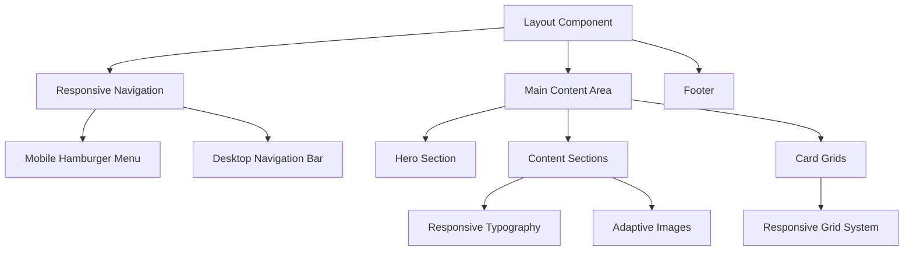

# Design Document: Mobile Responsive UI

## Overview

This design document outlines the implementation approach for making the portfolio website frontend fully mobile responsive. The system currently uses Next.js with Tailwind CSS and shadcn/ui components. We will enhance the existing responsive patterns and implement comprehensive mobile-first design principles across all pages and components.

The design leverages Tailwind CSS's built-in responsive utilities and extends the current component architecture to ensure optimal user experience across mobile, tablet, and desktop devices.

## Architecture

### Responsive Design Strategy

The system will implement a **mobile-first responsive design** approach using Tailwind CSS breakpoints:

- **Mobile**: Default styles (0px - 767px)
- **Tablet**: `md:` prefix (768px - 1023px) 
- **Desktop**: `lg:` and `xl:` prefixes (1024px+)

### Component Architecture



## Components and Interfaces

### 1. Responsive Layout System

**ResponsiveContainer Component**
```typescript
interface ResponsiveContainerProps {
  children: React.ReactNode
  maxWidth?: 'sm' | 'md' | 'lg' | 'xl' | '2xl'
  padding?: 'none' | 'sm' | 'md' | 'lg'
  className?: string
}
```

**Breakpoint Hook**
```typescript
interface UseBreakpointReturn {
  isMobile: boolean
  isTablet: boolean
  isDesktop: boolean
  currentBreakpoint: 'mobile' | 'tablet' | 'desktop'
}
```

### 2. Navigation Components

**MobileNavigation Component**
```typescript
interface MobileNavigationProps {
  isOpen: boolean
  onToggle: () => void
  menuItems: NavigationItem[]
}

interface NavigationItem {
  label: string
  href: string
  icon?: React.ComponentType
  isActive?: boolean
}
```

**ResponsiveNavigation Component**
```typescript
interface ResponsiveNavigationProps {
  menuItems: NavigationItem[]
  logo?: React.ReactNode
  className?: string
}
```

### 3. Grid and Layout Components

**ResponsiveGrid Component**
```typescript
interface ResponsiveGridProps {
  children: React.ReactNode
  columns: {
    mobile: number
    tablet: number
    desktop: number
  }
  gap?: 'sm' | 'md' | 'lg'
  className?: string
}
```

### 4. Enhanced Card Components

**ResponsiveCard Component** (extends existing ProjectCard)
```typescript
interface ResponsiveCardProps extends ProjectCardProps {
  layout?: 'vertical' | 'horizontal' | 'adaptive'
  imageAspectRatio?: 'square' | 'video' | 'auto'
  mobileStackLayout?: boolean
}
```

## Data Models

### Responsive Configuration

```typescript
interface ResponsiveConfig {
  breakpoints: {
    mobile: number
    tablet: number
    desktop: number
  }
  touchTargetMinSize: number
  fontSizes: {
    mobile: FontSizeScale
    tablet: FontSizeScale
    desktop: FontSizeScale
  }
  spacing: SpacingScale
}

interface FontSizeScale {
  xs: string
  sm: string
  base: string
  lg: string
  xl: string
  '2xl': string
  '3xl': string
  '4xl': string
  '5xl': string
}

interface SpacingScale {
  xs: string
  sm: string
  md: string
  lg: string
  xl: string
}
```

### Touch Interaction Models

```typescript
interface TouchTarget {
  minWidth: number
  minHeight: number
  padding: number
  margin: number
}

interface SwipeGesture {
  direction: 'left' | 'right' | 'up' | 'down'
  threshold: number
  velocity: number
}
```

## Correctness Properties

*A property is a characteristic or behavior that should hold true across all valid executions of a system-essentially, a formal statement about what the system should do. Properties serve as the bridge between human-readable specifications and machine-verifiable correctness guarantees.*

<function_calls>
<invoke name="prework">
<parameter name="featureName">mobile-responsive-ui

### Property Reflection

After reviewing all properties identified in the prework analysis, I've identified several areas where properties can be consolidated to eliminate redundancy:

**Layout Properties (1.1, 1.2, 1.3)** can be combined into a single comprehensive viewport responsiveness property that covers all breakpoints.

**Touch Target Properties (2.1, 2.5)** can be combined into a single property about touch target sizing and spacing.

**Content Adaptation Properties (3.1, 3.2, 3.4, 3.5)** can be streamlined to focus on the most critical adaptations.

**Performance Properties (4.1, 4.2, 4.3, 4.5)** can be consolidated into core performance requirements.

**Consistency Properties (5.1, 5.2, 5.3, 5.4)** overlap significantly and can be combined.

**Accessibility Properties (6.1, 6.2, 6.3, 6.4)** can be streamlined to focus on the most testable aspects.

### Correctness Properties

Property 1: Viewport responsiveness
*For any* viewport width, the system should display the appropriate layout (mobile for <768px, tablet for 768-1024px, desktop for >1024px) and adapt correctly to orientation changes
**Validates: Requirements 1.1, 1.2, 1.3, 1.4**

Property 2: Content overflow handling
*For any* content that exceeds viewport dimensions, the system should provide appropriate scrolling mechanisms without breaking layout
**Validates: Requirements 1.5**

Property 3: Touch target accessibility
*For any* interactive element on mobile devices, touch targets should be at least 44px in height and width with adequate spacing between elements
**Validates: Requirements 2.1, 2.5**

Property 4: Navigation feedback responsiveness
*For any* navigation element tap, the system should provide visual feedback within 100ms
**Validates: Requirements 2.2**

Property 5: Mobile menu pattern consistency
*For any* mobile viewport, navigation menus should use collapsible hamburger menu patterns
**Validates: Requirements 2.3**

Property 6: Swipe gesture support
*For any* touch-enabled device, the system should support appropriate swipe gestures for navigation
**Validates: Requirements 2.4**

Property 7: Mobile typography standards
*For any* body text content on mobile devices, font sizes should be at least 16px
**Validates: Requirements 3.1**

Property 8: Image viewport adaptation
*For any* image on mobile devices, images should scale appropriately to fit the viewport without overflow
**Validates: Requirements 3.2**

Property 9: Complex layout mobile adaptation
*For any* table or complex layout on mobile devices, the system should provide horizontal scrolling or alternative mobile-friendly layouts
**Validates: Requirements 3.3**

Property 10: Form element mobile stacking
*For any* form on mobile devices, form elements should be stacked vertically for optimal touch interaction
**Validates: Requirements 3.4**

Property 11: Grid responsiveness
*For any* card or grid layout, column counts should adjust appropriately based on screen size breakpoints
**Validates: Requirements 3.5**

Property 12: Mobile image optimization
*For any* image loaded on mobile networks, the system should deliver optimized images appropriate for mobile bandwidth
**Validates: Requirements 4.1**

Property 13: Layout stability during load
*For any* page render on mobile devices, cumulative layout shift should be minimized during page load
**Validates: Requirements 4.2**

Property 14: Above-fold content prioritization
*For any* page load, above-the-fold content should load before below-the-fold content
**Validates: Requirements 4.3**

Property 15: Animation performance consistency
*For any* animation on mobile devices, frame rates should maintain smooth 60fps performance
**Validates: Requirements 4.4**

Property 16: Lazy loading implementation
*For any* non-critical content, the system should implement lazy loading until the content is needed
**Validates: Requirements 4.5**

Property 17: Cross-device visual consistency
*For any* page accessed on different devices, branding and visual hierarchy should remain consistent
**Validates: Requirements 5.1**

Property 18: Functional equivalence across devices
*For any* interactive element, equivalent functionality should be provided across all device types
**Validates: Requirements 5.2**

Property 19: Information architecture consistency
*For any* content displayed across breakpoints, information architecture should remain consistent
**Validates: Requirements 5.3**

Property 20: User flow consistency
*For any* user journey, the flow should work identically across different device types
**Validates: Requirements 5.4**

Property 21: Device-appropriate error messaging
*For any* error state, appropriate messaging should be displayed for each device type
**Validates: Requirements 5.5**

Property 22: Mobile accessibility markup
*For any* content on mobile devices, proper semantic markup and ARIA labels should be provided for screen readers
**Validates: Requirements 6.1**

Property 23: Zoom accessibility compliance
*For any* content zoomed up to 200%, usability should be maintained without requiring horizontal scrolling
**Validates: Requirements 6.2**

Property 24: Mobile keyboard navigation visibility
*For any* keyboard navigation on mobile browsers, visible focus indicators should be provided
**Validates: Requirements 6.3**

Property 25: Color accessibility alternatives
*For any* color-coded information, alternative indicators beyond color alone should be provided
**Validates: Requirements 6.4**

Property 26: Media accessibility controls
*For any* audio or video content, appropriate controls should be provided for mobile accessibility features
**Validates: Requirements 6.5**

## Error Handling

### Responsive Breakpoint Failures
- **Fallback Strategy**: If CSS media queries fail, default to mobile-first layout
- **Detection**: Monitor viewport resize events and validate breakpoint application
- **Recovery**: Provide manual breakpoint override controls in development mode

### Touch Interaction Failures
- **Gesture Recognition**: Implement fallback click handlers for failed swipe gestures
- **Touch Target Validation**: Log warnings for touch targets below minimum size requirements
- **Accessibility Fallbacks**: Ensure keyboard navigation works when touch fails

### Performance Degradation
- **Image Loading**: Implement progressive image loading with low-quality placeholders
- **Animation Fallbacks**: Disable animations on low-performance devices
- **Lazy Loading Failures**: Provide immediate loading fallback for critical content

### Cross-Device Inconsistencies
- **Layout Validation**: Implement automated visual regression testing across devices
- **Feature Detection**: Use progressive enhancement for device-specific features
- **Graceful Degradation**: Ensure core functionality works without advanced responsive features

## Testing Strategy

### Dual Testing Approach

The testing strategy combines **unit tests** for specific responsive behaviors and **property-based tests** for comprehensive coverage across device variations.

**Unit Tests** will focus on:
- Specific breakpoint transitions (768px, 1024px boundaries)
- Touch target size validation for key interactive elements
- Image optimization for common screen densities
- Navigation menu state changes
- Form layout adaptations

**Property-Based Tests** will focus on:
- Universal responsive behavior across all viewport sizes
- Touch interaction consistency across all interactive elements
- Content adaptation across all content types
- Performance characteristics across device capabilities
- Accessibility compliance across all interface elements

### Property-Based Testing Configuration

- **Testing Library**: Jest with @testing-library/react and custom viewport simulation utilities
- **Minimum Iterations**: 100 iterations per property test
- **Device Simulation**: Generate random viewport dimensions, orientations, and device capabilities
- **Performance Monitoring**: Integrate with Web Vitals API for performance property validation

Each property test will be tagged with:
**Feature: mobile-responsive-ui, Property {number}: {property_text}**

### Testing Tools and Environment

- **Responsive Testing**: Playwright for cross-device browser testing
- **Visual Regression**: Percy or Chromatic for visual consistency validation
- **Performance Testing**: Lighthouse CI for mobile performance metrics
- **Accessibility Testing**: axe-core for automated accessibility validation
- **Touch Simulation**: Custom touch event simulation utilities

### Test Data Generation

- **Viewport Dimensions**: Generate random widths (320px-2560px) and heights (568px-1440px)
- **Content Variations**: Generate varying content lengths, image sizes, and layout complexities
- **Device Capabilities**: Simulate different touch capabilities, network speeds, and performance profiles
- **User Interactions**: Generate random touch gestures, keyboard navigation patterns, and zoom levels